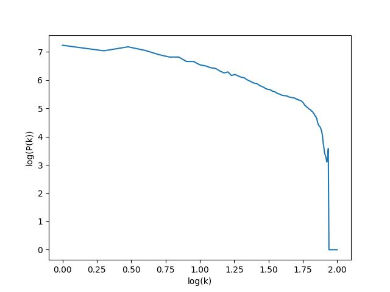
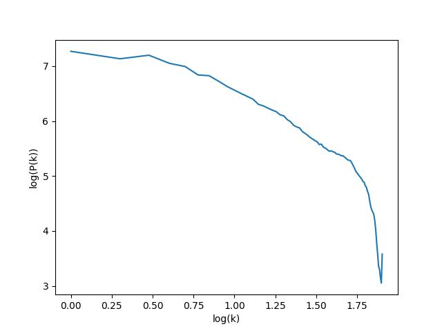
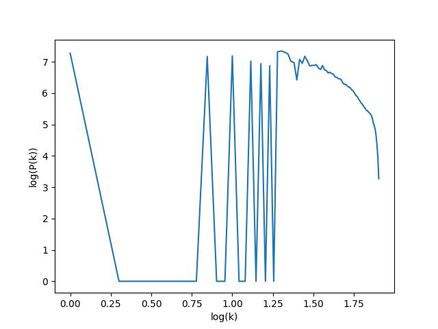

# Advanced High Performance Computing Exercise Sheet 6

## Exercise 1 [Calculating k]
`k` calculation in `mass_assignment/`

## Exercise 2 [Linear Binning]
The code is located in the `mass_assignment/` folder, and the output file with $P(k)$ values in linear binning format is `linear_binning.csv`

Note that if you want to obtain $P(k)$ values in linear binning format, you need to set the `binning` variable to $1$. By default, `binning` is set to 3, which produces logarithmic binning.

## Exercise 2 [Variable number of Bins]
The code is located in the `mass_assignment/` folder, and the output file with $P(k)$ values in variable binning format is `variable_binning.csv`

Note that if you want to obtain $P(k)$ values in variable number of bins format, you need to set the `binning` variable to $2$. By default, `binning` is set to 3, which produces logarithmic binning.

## Exercise 4 [Logarithmic Binning]
The code is located in the `mass_assignment/` folder, and the output file with $P(k)$ values in log binning format is `log_binning.csv`

