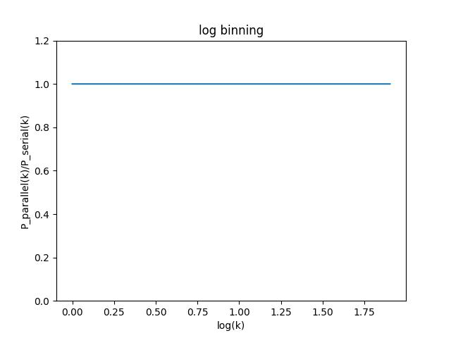
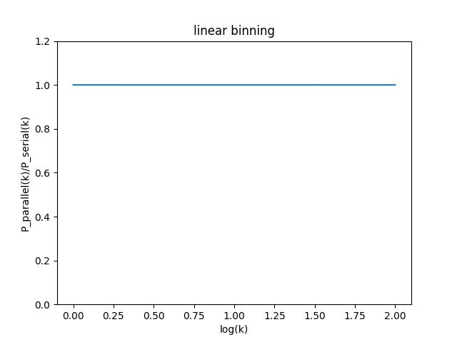
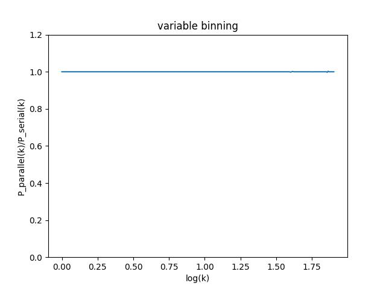

# Advanced High Performance Computing Exercise Sheet 7

## Exercise 1 [Enable MPI]
### 1. We will not put any MPI calls inside a parallel region, so which level of thread support is required (single, funneled, serialized or multiple)?

```
I ma not going to make any MPI calls inside a parallel region, then it is safe 
to assume that no MPI calls will be made concurrently by multiple threads. 
Therefore, the level of thread support required in this case could be 
"funneled" or higher.
```

### 2. Are the two processes automatically dividing up the work?
```
No, MPI processes do not automatically divide up work.
```

## Exercise 2 [Parallel/distributed read]
### Does the time to read the file, and the time to perform the mass assignment change?
```
Yes, it reduced
```

## Exercise 3 [Reduction]
### Plot $ \frac{P_{parallel} (k)}{P_{serial}(k)}$

  